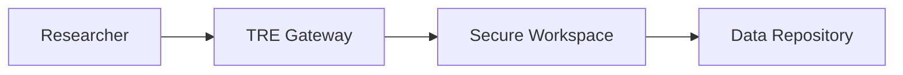

# Contributing

Thank you for your interest in contributing to the Trusted Research Environments documentation!

## How to Contribute

### Adding Resources

If you have links, materials, or resources to share:

1. Fork the repository
2. Add your content to the appropriate section:
   - Links: `docs/resources/links.md`
   - Materials: `docs/resources/materials.md`
   - Architecture: `docs/resources/architecture.md`
3. Submit a pull request with a clear description

### Improving Documentation

We welcome improvements to existing documentation:

- Fix typos or clarify content
- Add examples or use cases
- Improve organization and navigation
- Add diagrams or visualizations

### Adding Architectural Diagrams

We use Mermaid for architectural diagrams. Here's a simple example:



To add a diagram:

1. Use Mermaid syntax in markdown files
2. Place the diagram in an appropriate section
3. Add explanatory text around the diagram

## Guidelines

- Keep content relevant to TREs
- Provide proper attribution for external resources
- Use clear, accessible language
- Follow the existing document structure

## Development Setup

This site uses MkDocs with the Material theme. To work on it locally:

```bash
# Install dependencies
pip install -r requirements.txt

# Serve locally
mkdocs serve

# Build the site
mkdocs build
```

Or use the included devcontainer for a pre-configured development environment.

## Questions?

If you have questions or suggestions, please open an issue on the GitHub repository.
