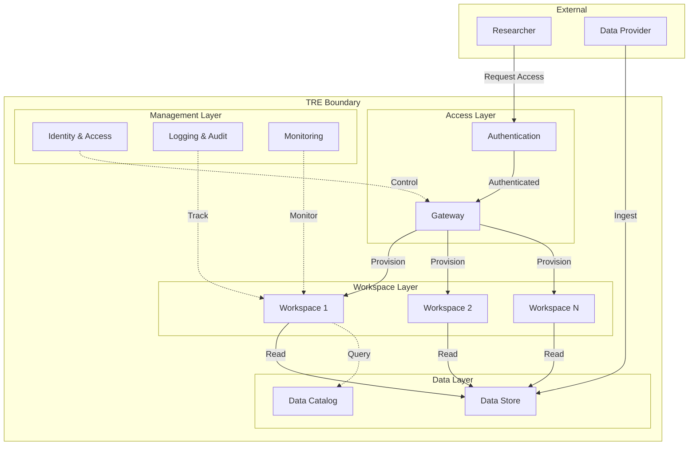
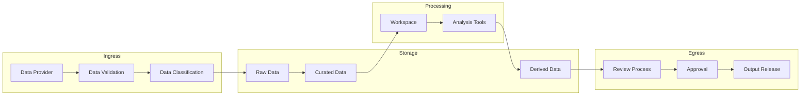
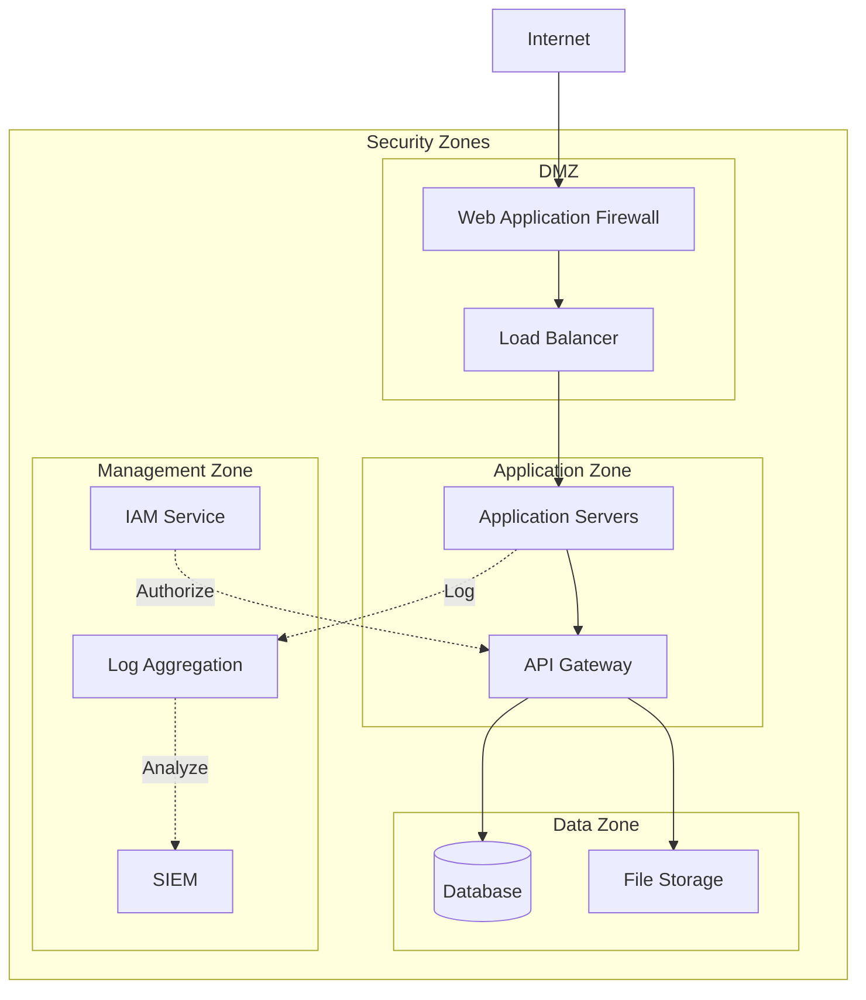
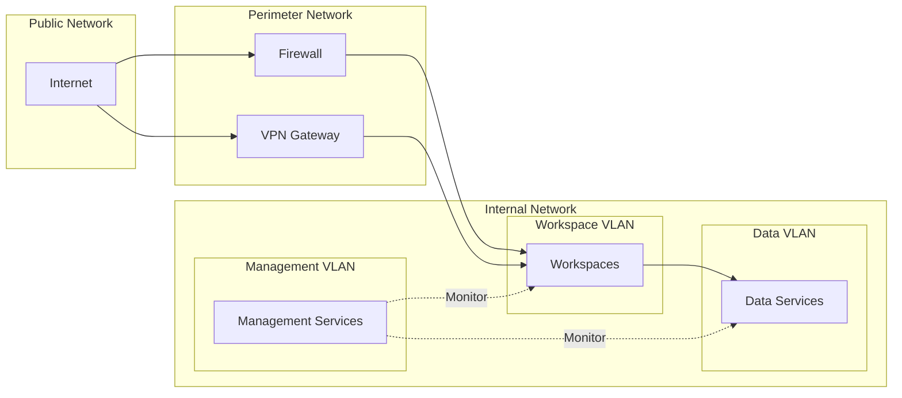
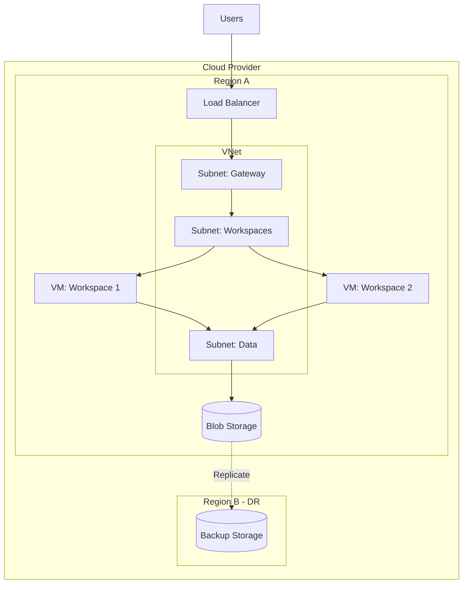
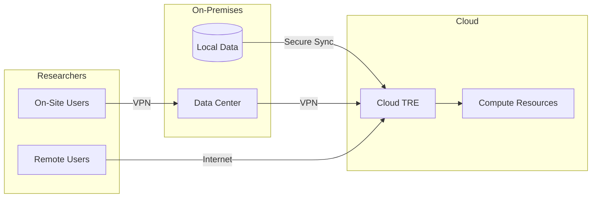
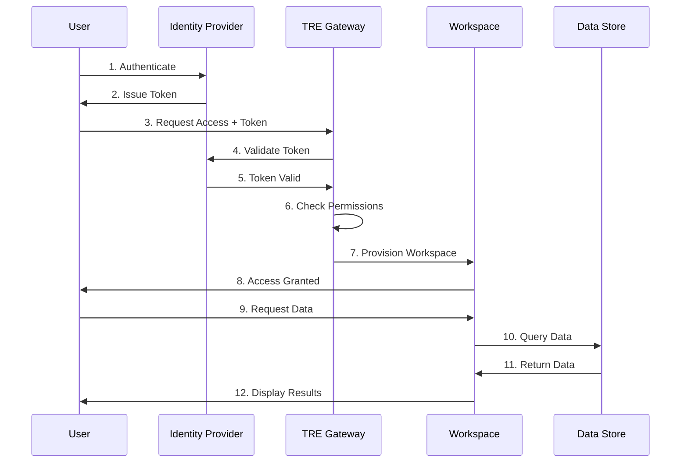

# Architecture

This page contains architectural diagrams, patterns, and design references for Trusted Research Environments.

## High-Level Architecture

### Basic TRE Architecture

This diagram shows the fundamental components of a TRE:

- **Access Layer**: Authentication and gateway for researcher access
- **Workspace Layer**: Isolated environments for different projects
- **Data Layer**: Secure storage and cataloging of sensitive data
- **Management Layer**: Cross-cutting concerns like identity, logging, and monitoring

## Detailed Component Architectures

### Data Flow Architecture

### Security Architecture

## Network Architecture

### Network Segmentation

## Deployment Patterns

### Cloud-Based TRE

### Hybrid TRE

## Identity & Access Management

## Design Patterns

### Multi-Tenancy Pattern

**Problem**: Multiple research projects need isolated environments within the same TRE infrastructure.

**Solution**: Implement logical separation using:
- Dedicated workspaces per project
- Role-based access control
- Data segregation
- Resource quotas

### Data Minimization Pattern

**Problem**: Researchers may not need access to full datasets.

**Solution**: 
- Implement data views with column/row-level filtering
- Use synthetic or anonymized data for development
- Provide aggregate data where possible

### Auditability Pattern

**Problem**: Need comprehensive audit trails for compliance.

**Solution**:
- Log all access attempts and data operations
- Immutable audit logs
- Centralized log aggregation
- Regular audit reviews

---

!!! tip "Adding Diagrams"
    We use Mermaid for diagrams. See the [Contributing Guide](../about/contributing.md) for examples.
